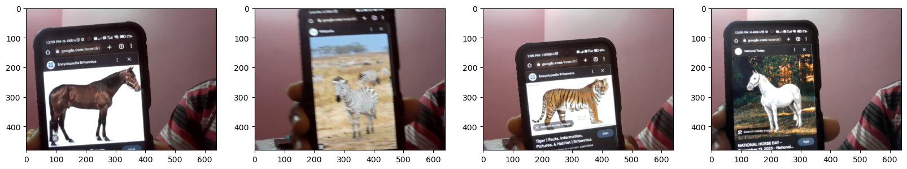
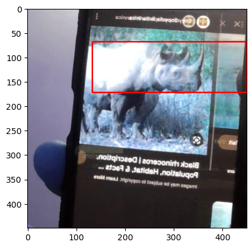
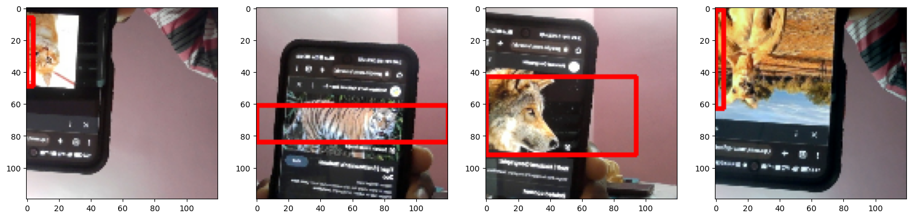
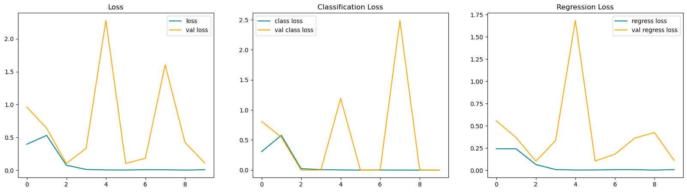
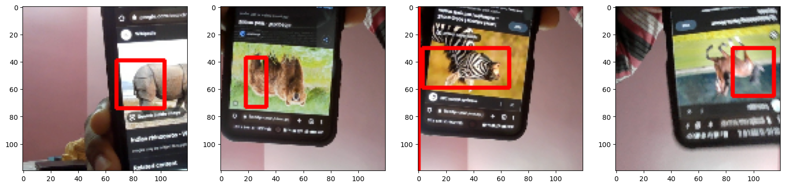

# Fauna Finder

# 1. Setting up and getting the data

1.1 Installing Dependent libraries and setup


```python
!pip install labelme tensorflow opencv-python matplotlib albumentations
```

    Defaulting to user installation because normal site-packages is not writeable
    Requirement already satisfied: labelme in c:\users\dhaush raj\appdata\roaming\python\python39\site-packages (5.1.1)
    Requirement already satisfied: tensorflow in c:\users\dhaush raj\appdata\roaming\python\python39\site-packages (2.11.0)
    Requirement already satisfied: opencv-python in c:\users\dhaush raj\appdata\roaming\python\python39\site-packages (4.7.0.68)
    Requirement already satisfied: matplotlib in c:\programdata\anaconda3\lib\site-packages (3.5.2)
    Requirement already satisfied: albumentations in c:\users\dhaush raj\appdata\roaming\python\python39\site-packages (1.3.0)
    Requirement already satisfied: natsort>=7.1.0 in c:\users\dhaush raj\appdata\roaming\python\python39\site-packages (from labelme) (8.2.0)
    Requirement already satisfied: imgviz>=0.11 in c:\users\dhaush raj\appdata\roaming\python\python39\site-packages (from labelme) (1.7.2)
    Requirement already satisfied: qtpy!=1.11.2 in c:\programdata\anaconda3\lib\site-packages (from labelme) (2.2.0)
    Requirement already satisfied: colorama in c:\programdata\anaconda3\lib\site-packages (from labelme) (0.4.5)
    Requirement already satisfied: Pillow>=2.8 in c:\programdata\anaconda3\lib\site-packages (from labelme) (9.2.0)
    Requirement already satisfied: numpy in c:\programdata\anaconda3\lib\site-packages (from labelme) (1.21.5)
    Requirement already satisfied: PyYAML in c:\programdata\anaconda3\lib\site-packages (from labelme) (6.0)
    Requirement already satisfied: termcolor in c:\users\dhaush raj\appdata\roaming\python\python39\site-packages (from labelme) (2.2.0)
    Requirement already satisfied: tensorflow-intel==2.11.0 in c:\users\dhaush raj\appdata\roaming\python\python39\site-packages (from tensorflow) (2.11.0)
    Requirement already satisfied: setuptools in c:\programdata\anaconda3\lib\site-packages (from tensorflow-intel==2.11.0->tensorflow) (63.4.1)
    Requirement already satisfied: astunparse>=1.6.0 in c:\users\dhaush raj\appdata\roaming\python\python39\site-packages (from tensorflow-intel==2.11.0->tensorflow) (1.6.3)
    Requirement already satisfied: google-pasta>=0.1.1 in c:\users\dhaush raj\appdata\roaming\python\python39\site-packages (from tensorflow-intel==2.11.0->tensorflow) (0.2.0)
    Requirement already satisfied: protobuf<3.20,>=3.9.2 in c:\users\dhaush raj\appdata\roaming\python\python39\site-packages (from tensorflow-intel==2.11.0->tensorflow) (3.19.6)
    Requirement already satisfied: wrapt>=1.11.0 in c:\programdata\anaconda3\lib\site-packages (from tensorflow-intel==2.11.0->tensorflow) (1.14.1)
    Requirement already satisfied: tensorflow-estimator<2.12,>=2.11.0 in c:\users\dhaush raj\appdata\roaming\python\python39\site-packages (from tensorflow-intel==2.11.0->tensorflow) (2.11.0)
    Requirement already satisfied: six>=1.12.0 in c:\programdata\anaconda3\lib\site-packages (from tensorflow-intel==2.11.0->tensorflow) (1.16.0)
    Requirement already satisfied: flatbuffers>=2.0 in c:\users\dhaush raj\appdata\roaming\python\python39\site-packages (from tensorflow-intel==2.11.0->tensorflow) (23.1.21)
    Requirement already satisfied: absl-py>=1.0.0 in c:\users\dhaush raj\appdata\roaming\python\python39\site-packages (from tensorflow-intel==2.11.0->tensorflow) (1.4.0)
    Requirement already satisfied: tensorboard<2.12,>=2.11 in c:\users\dhaush raj\appdata\roaming\python\python39\site-packages (from tensorflow-intel==2.11.0->tensorflow) (2.11.2)
    Requirement already satisfied: packaging in c:\programdata\anaconda3\lib\site-packages (from tensorflow-intel==2.11.0->tensorflow) (21.3)
    Requirement already satisfied: libclang>=13.0.0 in c:\users\dhaush raj\appdata\roaming\python\python39\site-packages (from tensorflow-intel==2.11.0->tensorflow) (15.0.6.1)
    Requirement already satisfied: gast<=0.4.0,>=0.2.1 in c:\users\dhaush raj\appdata\roaming\python\python39\site-packages (from tensorflow-intel==2.11.0->tensorflow) (0.4.0)
    Requirement already satisfied: grpcio<2.0,>=1.24.3 in c:\users\dhaush raj\appdata\roaming\python\python39\site-packages (from tensorflow-intel==2.11.0->tensorflow) (1.51.1)
    Requirement already satisfied: tensorflow-io-gcs-filesystem>=0.23.1 in c:\users\dhaush raj\appdata\roaming\python\python39\site-packages (from tensorflow-intel==2.11.0->tensorflow) (0.30.0)
    Requirement already satisfied: typing-extensions>=3.6.6 in c:\programdata\anaconda3\lib\site-packages (from tensorflow-intel==2.11.0->tensorflow) (4.3.0)
    Requirement already satisfied: keras<2.12,>=2.11.0 in c:\users\dhaush raj\appdata\roaming\python\python39\site-packages (from tensorflow-intel==2.11.0->tensorflow) (2.11.0)
    Requirement already satisfied: h5py>=2.9.0 in c:\programdata\anaconda3\lib\site-packages (from tensorflow-intel==2.11.0->tensorflow) (3.7.0)
    Requirement already satisfied: opt-einsum>=2.3.2 in c:\users\dhaush raj\appdata\roaming\python\python39\site-packages (from tensorflow-intel==2.11.0->tensorflow) (3.3.0)
    Requirement already satisfied: kiwisolver>=1.0.1 in c:\programdata\anaconda3\lib\site-packages (from matplotlib) (1.4.2)
    Requirement already satisfied: pyparsing>=2.2.1 in c:\programdata\anaconda3\lib\site-packages (from matplotlib) (3.0.9)
    Requirement already satisfied: fonttools>=4.22.0 in c:\programdata\anaconda3\lib\site-packages (from matplotlib) (4.25.0)
    Requirement already satisfied: cycler>=0.10 in c:\programdata\anaconda3\lib\site-packages (from matplotlib) (0.11.0)
    Requirement already satisfied: python-dateutil>=2.7 in c:\programdata\anaconda3\lib\site-packages (from matplotlib) (2.8.2)
    Requirement already satisfied: scipy in c:\programdata\anaconda3\lib\site-packages (from albumentations) (1.9.1)
    Requirement already satisfied: qudida>=0.0.4 in c:\users\dhaush raj\appdata\roaming\python\python39\site-packages (from albumentations) (0.0.4)
    Requirement already satisfied: opencv-python-headless>=4.1.1 in c:\users\dhaush raj\appdata\roaming\python\python39\site-packages (from albumentations) (4.7.0.68)
    Requirement already satisfied: scikit-image>=0.16.1 in c:\programdata\anaconda3\lib\site-packages (from albumentations) (0.19.2)
    Requirement already satisfied: scikit-learn>=0.19.1 in c:\programdata\anaconda3\lib\site-packages (from qudida>=0.0.4->albumentations) (1.0.2)
    Requirement already satisfied: imageio>=2.4.1 in c:\programdata\anaconda3\lib\site-packages (from scikit-image>=0.16.1->albumentations) (2.19.3)
    Requirement already satisfied: tifffile>=2019.7.26 in c:\programdata\anaconda3\lib\site-packages (from scikit-image>=0.16.1->albumentations) (2021.7.2)
    Requirement already satisfied: networkx>=2.2 in c:\programdata\anaconda3\lib\site-packages (from scikit-image>=0.16.1->albumentations) (2.8.4)
    Requirement already satisfied: PyWavelets>=1.1.1 in c:\programdata\anaconda3\lib\site-packages (from scikit-image>=0.16.1->albumentations) (1.3.0)
    Requirement already satisfied: wheel<1.0,>=0.23.0 in c:\programdata\anaconda3\lib\site-packages (from astunparse>=1.6.0->tensorflow-intel==2.11.0->tensorflow) (0.37.1)
    Requirement already satisfied: joblib>=0.11 in c:\programdata\anaconda3\lib\site-packages (from scikit-learn>=0.19.1->qudida>=0.0.4->albumentations) (1.1.0)
    Requirement already satisfied: threadpoolctl>=2.0.0 in c:\programdata\anaconda3\lib\site-packages (from scikit-learn>=0.19.1->qudida>=0.0.4->albumentations) (2.2.0)
    Requirement already satisfied: tensorboard-plugin-wit>=1.6.0 in c:\users\dhaush raj\appdata\roaming\python\python39\site-packages (from tensorboard<2.12,>=2.11->tensorflow-intel==2.11.0->tensorflow) (1.8.1)
    Requirement already satisfied: google-auth<3,>=1.6.3 in c:\users\dhaush raj\appdata\roaming\python\python39\site-packages (from tensorboard<2.12,>=2.11->tensorflow-intel==2.11.0->tensorflow) (2.16.0)
    Requirement already satisfied: requests<3,>=2.21.0 in c:\programdata\anaconda3\lib\site-packages (from tensorboard<2.12,>=2.11->tensorflow-intel==2.11.0->tensorflow) (2.28.1)
    Requirement already satisfied: werkzeug>=1.0.1 in c:\programdata\anaconda3\lib\site-packages (from tensorboard<2.12,>=2.11->tensorflow-intel==2.11.0->tensorflow) (2.0.3)
    Requirement already satisfied: google-auth-oauthlib<0.5,>=0.4.1 in c:\users\dhaush raj\appdata\roaming\python\python39\site-packages (from tensorboard<2.12,>=2.11->tensorflow-intel==2.11.0->tensorflow) (0.4.6)
    Requirement already satisfied: markdown>=2.6.8 in c:\programdata\anaconda3\lib\site-packages (from tensorboard<2.12,>=2.11->tensorflow-intel==2.11.0->tensorflow) (3.3.4)
    Requirement already satisfied: tensorboard-data-server<0.7.0,>=0.6.0 in c:\users\dhaush raj\appdata\roaming\python\python39\site-packages (from tensorboard<2.12,>=2.11->tensorflow-intel==2.11.0->tensorflow) (0.6.1)
    Requirement already satisfied: rsa<5,>=3.1.4 in c:\users\dhaush raj\appdata\roaming\python\python39\site-packages (from google-auth<3,>=1.6.3->tensorboard<2.12,>=2.11->tensorflow-intel==2.11.0->tensorflow) (4.9)
    Requirement already satisfied: cachetools<6.0,>=2.0.0 in c:\users\dhaush raj\appdata\roaming\python\python39\site-packages (from google-auth<3,>=1.6.3->tensorboard<2.12,>=2.11->tensorflow-intel==2.11.0->tensorflow) (5.3.0)
    Requirement already satisfied: pyasn1-modules>=0.2.1 in c:\programdata\anaconda3\lib\site-packages (from google-auth<3,>=1.6.3->tensorboard<2.12,>=2.11->tensorflow-intel==2.11.0->tensorflow) (0.2.8)
    Requirement already satisfied: requests-oauthlib>=0.7.0 in c:\users\dhaush raj\appdata\roaming\python\python39\site-packages (from google-auth-oauthlib<0.5,>=0.4.1->tensorboard<2.12,>=2.11->tensorflow-intel==2.11.0->tensorflow) (1.3.1)
    Requirement already satisfied: charset-normalizer<3,>=2 in c:\programdata\anaconda3\lib\site-packages (from requests<3,>=2.21.0->tensorboard<2.12,>=2.11->tensorflow-intel==2.11.0->tensorflow) (2.0.4)
    Requirement already satisfied: idna<4,>=2.5 in c:\programdata\anaconda3\lib\site-packages (from requests<3,>=2.21.0->tensorboard<2.12,>=2.11->tensorflow-intel==2.11.0->tensorflow) (3.3)
    Requirement already satisfied: certifi>=2017.4.17 in c:\programdata\anaconda3\lib\site-packages (from requests<3,>=2.21.0->tensorboard<2.12,>=2.11->tensorflow-intel==2.11.0->tensorflow) (2022.9.14)
    Requirement already satisfied: urllib3<1.27,>=1.21.1 in c:\programdata\anaconda3\lib\site-packages (from requests<3,>=2.21.0->tensorboard<2.12,>=2.11->tensorflow-intel==2.11.0->tensorflow) (1.26.11)
    Requirement already satisfied: pyasn1<0.5.0,>=0.4.6 in c:\programdata\anaconda3\lib\site-packages (from pyasn1-modules>=0.2.1->google-auth<3,>=1.6.3->tensorboard<2.12,>=2.11->tensorflow-intel==2.11.0->tensorflow) (0.4.8)
    Requirement already satisfied: oauthlib>=3.0.0 in c:\users\dhaush raj\appdata\roaming\python\python39\site-packages (from requests-oauthlib>=0.7.0->google-auth-oauthlib<0.5,>=0.4.1->tensorboard<2.12,>=2.11->tensorflow-intel==2.11.0->tensorflow) (3.2.2)
    

1.2 Importing libraries to collect images using opencv


```python
import os
import time
import uuid #uniform unique identifier
import cv2
```


```python
IMAGES_PATH = os.path.join('data','images')
number_images = 15
```


```python
cap = cv2.VideoCapture(0)
for imgnum in range(number_images):
    print('Collecting image {}'.format(imgnum))
    ret, frame = cap.read()
    imgname = os.path.join(IMAGES_PATH,f'{str(uuid.uuid1())}.jpg')
    cv2.imwrite(imgname, frame)
    cv2.imshow('frame', frame)
    time.sleep(5)

    if cv2.waitKey(1) & 0xFF == ord('q'):
        break
cap.release()
cv2.destroyAllWindows()
```

    Collecting image 0
    Collecting image 1
    Collecting image 2
    Collecting image 3
    Collecting image 4
    Collecting image 5
    Collecting image 6
    Collecting image 7
    Collecting image 8
    Collecting image 9
    Collecting image 10
    Collecting image 11
    Collecting image 12
    Collecting image 13
    Collecting image 14
    

1.3 Annotate Images with LabelMe


```python
!labelme
```

# 2. Reviewing the Dataset and Build Image Loading Function

### 2.1 Importing Tensorflow and Dependencies


```python
import tensorflow as tf
import json
import numpy as np
from matplotlib import pyplot as plt
```

### 2.2 Load Image into TF Data Pipeline


```python
images = tf.data.Dataset.list_files('data\\images\\*.jpg')
```


```python
images.as_numpy_iterator().next()
```


    b'data\\images\\b78634be-adc9-11ed-889d-60189536bc9e.jpg'


```python
def load_image(x): 
    byte_img = tf.io.read_file(x)
    img = tf.io.decode_jpeg(byte_img)
    return img
```


```python
images = images.map(load_image)
```


```python
images.as_numpy_iterator().next()
```


    array([[[208, 194, 207],
            [208, 194, 207],
            [209, 193, 204],
            ...,
            [ 11,  15,  14],
            [ 22,  28,  28],
            [ 24,  30,  30]],
    
           [[207, 193, 206],
            [207, 193, 206],
            [208, 192, 203],
            ...,
            [ 12,  16,  15],
            [ 19,  23,  22],
            [ 24,  28,  27]],
    
           [[208, 192, 203],
            [208, 192, 203],
            [208, 192, 203],
            ...,
            [ 15,  17,  14],
            [ 16,  18,  15],
            [ 21,  23,  20]],
    
           ...,
    
           [[118,  89,  55],
            [118,  90,  53],
            [110,  80,  42],
            ...,
            [ 28,  26,  31],
            [ 27,  25,  30],
            [ 27,  25,  28]],
    
           [[123,  93,  59],
            [127,  97,  61],
            [129,  97,  58],
            ...,
            [ 26,  25,  30],
            [ 25,  24,  29],
            [ 25,  24,  29]],
    
           [[137, 107,  73],
            [136, 106,  70],
            [141, 109,  70],
            ...,
            [ 24,  25,  30],
            [ 24,  25,  29],
            [ 25,  26,  30]]], dtype=uint8)


```python
type(images)
```


    tensorflow.python.data.ops.dataset_ops.MapDataset


### 2.3 View Raw Images with Matplotlib


```python
image_generator = images.batch(4).as_numpy_iterator()
```


```python
plot_images = image_generator.next()
```


```python
fig, ax = plt.subplots(ncols=4, figsize=(20,20))
for idx, image in enumerate(plot_images):
    ax[idx].imshow(image) 
plt.show()
```


    

    


## 3. Partition Unaugmented Data

### 3.1 Splitting data into Train, Test and Valuation set - Manually


```python
228*.7 #161 to train
```


    159.6


```python
228*.15 #35 to test and 34 to val
```


    34.199999999999996


### 3.2 Moving the matching labels:


```python
for folder in ['train','test','val']:
    for file in os.listdir(os.path.join('data', folder, 'images')):
        
        filename = file.split('.')[0]+'.json'
        existing_filepath = os.path.join('data','labels', filename)
        if os.path.exists(existing_filepath): 
            new_filepath = os.path.join('data',folder,'labels',filename)
            os.replace(existing_filepath, new_filepath)
```

## 4. Apply Image Augmentation on Images and Labels using Albumentations

### 4.1 Setup Albumentations Transform Pipeline


```python
import albumentations as alb
```


```python
augmentor = alb.Compose([alb.RandomCrop(width=450, height=450), 
                         alb.HorizontalFlip(p=0.5), 
                         alb.RandomBrightnessContrast(p=0.2),
                         alb.RandomGamma(p=0.2), 
                         alb.RGBShift(p=0.2), 
                         alb.VerticalFlip(p=0.5)], 
                         bbox_params=alb.BboxParams(format='albumentations', 
                         label_fields=['class_labels']))
```

### 4.2 Load a Test Image and Annotation with OpenCV and JSON


```python
img = cv2.imread(os.path.join('data','train', 'images','1f7c90f0-add5-11ed-9f94-60189536bc9e.jpg'))
```


```python
with open(os.path.join('data', 'train', 'labels', '1f7c90f0-add5-11ed-9f94-60189536bc9e.json'), 'r') as f:
    label = json.load(f)
```


```python
label['shapes']
```


    [{'label': 'rhinoceros',
      'points': [[146.4102564102564, 78.46153846153847],
       [297.1794871794872, 182.05128205128204]],
      'group_id': None,
      'shape_type': 'rectangle',
      'flags': {}}]


### 4.3 Extract Coordinates and Rescale to Match Image Resolution


```python
coords = [0,0,0,0]
coords[0] = label['shapes'][0]['points'][0][0]
coords[1] = label['shapes'][0]['points'][0][1]
coords[2] = label['shapes'][0]['points'][1][0]
coords[3] = label['shapes'][0]['points'][1][1]
```


```python
coords
```


    [368.46153846153845, 300.51282051282055, 230.5128205128205, 425.6410256410257]


```python
coords = list(np.divide(coords, [720,480,360,480]))
```


```python
coords
```


    [0.5117521367521367,
     0.6260683760683762,
     0.6403133903133903,
     0.8867521367521368]


### 4.4 Apply Augmentations and View Results


```python
augmented = augmentor(image=img, bboxes=[coords] , class_labels=['rhinoceros'])
```


```python
augmented['bboxes'][0][2:]
```


    (0.5328901551123774, 0.8792022792022793)


```python
augmented['bboxes']
```


    [(0.35004748338081665,
      0.6011396011396012,
      0.5328901551123774,
      0.8792022792022793)]


```python
augmented['image']
```


    array([[[ 43,  31,  27],
            [ 41,  29,  25],
            [ 40,  29,  25],
            ...,
            [ 33,  26,  53],
            [ 36,  29,  56],
            [ 34,  25,  52]],
    
           [[ 44,  32,  30],
            [ 41,  29,  27],
            [ 40,  31,  28],
            ...,
            [ 36,  28,  59],
            [ 34,  26,  57],
            [ 34,  24,  54]],
    
           [[ 44,  32,  32],
            [ 45,  33,  31],
            [ 42,  33,  30],
            ...,
            [ 34,  24,  60],
            [ 32,  23,  56],
            [ 33,  22,  54]],
    
           ...,
    
           [[101,  90,  92],
            [ 97,  86,  88],
            [109,  98, 100],
            ...,
            [148, 143, 172],
            [148, 143, 172],
            [150, 142, 172]],
    
           [[ 97,  86,  88],
            [102,  91,  93],
            [104,  93,  95],
            ...,
            [148, 143, 172],
            [148, 143, 172],
            [150, 142, 172]],
    
           [[102,  90,  90],
            [ 98,  87,  89],
            [ 99,  88,  90],
            ...,
            [149, 144, 173],
            [148, 143, 172],
            [150, 142, 172]]], dtype=uint8)


```python
cv2.rectangle(augmented['image'], 
              tuple(np.multiply(augmented['bboxes'][0][:2], [450,450]).astype(int)),
              tuple(np.multiply(augmented['bboxes'][0][2:], [450,450]).astype(int)), 
                    (255,0,0), 2)

plt.imshow(augmented['image'])
```


    <matplotlib.image.AxesImage at 0x24bfcedc280>


    

    


## 5. Build and Run Augmentation Pipeline

### 5.1 Run Augmentation Pipeline


```python
for partition in ['train','test','val']: 
    for image in os.listdir(os.path.join('data', partition, 'images')):
        img = cv2.imread(os.path.join('data', partition, 'images', image))

        coords = [0,0,0.00001,0.00001]
        label_path = os.path.join('data', partition, 'labels', f'{image.split(".")[0]}.json')
        if os.path.exists(label_path):
            with open(label_path, 'r') as f:
                label = json.load(f)

            coords[0] = label['shapes'][0]['points'][0][0]
            coords[1] = label['shapes'][0]['points'][0][1]
            coords[2] = label['shapes'][0]['points'][1][0]
            coords[3] = label['shapes'][0]['points'][1][1]
            coords = list(np.divide(coords, [1700,480,500,480]))

        try: 
            for x in range(60):
                augmented = augmentor(image=img, bboxes=[coords], class_labels=['face'])
                cv2.imwrite(os.path.join('aug_data', partition, 'images', f'{image.split(".")[0]}.{x}.jpg'), augmented['image'])

                annotation = {}
                annotation['image'] = image

                if os.path.exists(label_path):
                    if len(augmented['bboxes']) == 0: 
                        annotation['bbox'] = [0,0,0,0]
                        annotation['class'] = 0 
                    else: 
                        annotation['bbox'] = augmented['bboxes'][0]
                        annotation['class'] = 1
                else: 
                    annotation['bbox'] = [0,0,0,0]
                    annotation['class'] = 0 


                with open(os.path.join('aug_data', partition, 'labels', f'{image.split(".")[0]}.{x}.json'), 'w') as f:
                    json.dump(annotation, f)

        except Exception as e:
            print(e)
            
```

    image must be numpy array type
    Expected x_max for bbox [0.20346907993966817, 0.3301282051282051, 1.1307692307692307, 0.75, 'face'] to be in the range [0.0, 1.0], got 1.1307692307692307.
    y_max is less than or equal to y_min for bbox [0.21161387631975867, 0.07905982905982906, 0.4815384615384615, 0.006410256410256411, 'face'].
    x_max is less than or equal to x_min for bbox [0.19019607843137254, 0.5288461538461539, 0.1676923076923077, 0.875, 'face'].
    x_max is less than or equal to x_min for bbox [0.17541478129713423, 0.2863247863247863, 0.1676923076923077, 0.7297008547008548, 'face'].
    x_max is less than or equal to x_min for bbox [0.14947209653092006, 0.6933760683760684, 0.11230769230769229, 0.9754273504273505, 'face'].
    x_max is less than or equal to x_min for bbox [0.23755656108597287, 0.3888888888888889, 0.23641025641025643, 0.8803418803418804, 'face'].
    x_max is less than or equal to x_min for bbox [0.16365007541478127, 0.452991452991453, 0.16358974358974362, 0.8707264957264957, 'face'].
    x_max is less than or equal to x_min for bbox [0.2339366515837104, 0.4839743589743589, 0.1943589743589744, 0.7670940170940171, 'face'].
    x_max is less than or equal to x_min for bbox [0.2200603318250377, 0.4551282051282051, 0.19538461538461538, 0.735042735042735, 'face'].
    x_max is less than or equal to x_min for bbox [0.17631975867269983, 0.2745726495726496, 0.13384615384615384, 0.622863247863248, 'face'].
    x_max is less than or equal to x_min for bbox [0.19441930618401207, 0.2735042735042735, 0.16153846153846152, 0.688034188034188, 'face'].
    x_max is less than or equal to x_min for bbox [0.1757164404223228, 0.5865384615384616, 0.15948717948717947, 0.8237179487179488, 'face'].
    x_max is less than or equal to x_min for bbox [0.10844645550527904, 0.7232905982905983, 0.003589743589743591, 0.9925213675213675, 'face'].
    y_max is less than or equal to y_min for bbox [0.08944193061840121, 0.9497863247863249, 0.5943589743589743, 0.43162393162393164, 'face'].
    x_max is less than or equal to x_min for bbox [0.16184012066365008, 0.5331196581196581, 0.11948717948717948, 0.8910256410256411, 'face'].
    x_max is less than or equal to x_min for bbox [0.18627450980392157, 0.5950854700854701, 0.1851282051282051, 0.997863247863248, 'face'].
    x_max is less than or equal to x_min for bbox [0.11266968325791855, 0.5213675213675214, 0.009743589743589751, 0.9337606837606838, 'face'].
    x_max is less than or equal to x_min for bbox [0.16485671191553547, 0.4412393162393162, 0.14923076923076925, 0.8782051282051282, 'face'].
    x_max is less than or equal to x_min for bbox [0.21493212669683256, 0.3888888888888889, 0.1287179487179487, 0.6816239316239316, 'face'].
    x_max is less than or equal to x_min for bbox [0.16153846153846152, 0.3173076923076923, 0.15743589743589742, 0.7264957264957265, 'face'].
    x_max is less than or equal to x_min for bbox [0.16425339366515837, 0.47435897435897434, 0.11538461538461539, 0.997863247863248, 'face'].
    Expected x_max for bbox [0.2209653092006033, 0.4412393162393162, 1.011794871794872, 0.7809829059829061, 'face'] to be in the range [0.0, 1.0], got 1.011794871794872.
    Expected x_max for bbox [0.20015082956259428, 0.40384615384615385, 1.0158974358974358, 0.6848290598290598, 'face'] to be in the range [0.0, 1.0], got 1.0158974358974358.
    x_max is less than or equal to x_min for bbox [0.22941176470588234, 0.5395299145299146, 0.16153846153846152, 0.9401709401709403, 'face'].
    x_max is less than or equal to x_min for bbox [0.13891402714932125, 0.42735042735042733, 0.08051282051282052, 0.9551282051282052, 'face'].
    x_max is less than or equal to x_min for bbox [0.17450980392156865, 0.3333333333333333, 0.09384615384615384, 0.6848290598290598, 'face'].
    

### 5.2 Load Augmented Images to Tensorflow Dataset


```python
train_images = tf.data.Dataset.list_files('aug_data\\train\\images\\*.jpg', shuffle=False)
train_images = train_images.map(load_image)
train_images = train_images.map(lambda x: tf.image.resize(x, (120,120)))
train_images = train_images.map(lambda x: x/255)
```

    WARNING:tensorflow:From C:\Users\Dhaush Raj\AppData\Roaming\Python\Python39\site-packages\tensorflow\python\autograph\pyct\static_analysis\liveness.py:83: Analyzer.lamba_check (from tensorflow.python.autograph.pyct.static_analysis.liveness) is deprecated and will be removed after 2023-09-23.
    Instructions for updating:
    Lambda fuctions will be no more assumed to be used in the statement where they are used, or at least in the same block. https://github.com/tensorflow/tensorflow/issues/56089
    


```python
test_images = tf.data.Dataset.list_files('aug_data\\test\\images\\*.jpg', shuffle=False)
test_images = test_images.map(load_image)
test_images = test_images.map(lambda x: tf.image.resize(x, (120,120)))
test_images = test_images.map(lambda x: x/255)
```


```python
val_images = tf.data.Dataset.list_files('aug_data\\val\\images\\*.jpg', shuffle=False)
val_images = val_images.map(load_image)
val_images = val_images.map(lambda x: tf.image.resize(x, (120,120)))
val_images = val_images.map(lambda x: x/255)
```


```python
train_images.as_numpy_iterator().next()
```


    array([[[5.52941203e-01, 4.00000006e-01, 4.74509805e-01],
            [5.49019635e-01, 3.96078438e-01, 4.70404416e-01],
            [5.40992618e-01, 3.94914210e-01, 4.64522064e-01],
            ...,
            [3.72549027e-01, 2.47058824e-01, 3.05882365e-01],
            [3.68627459e-01, 2.43137255e-01, 3.01960796e-01],
            [3.69178921e-01, 2.43688732e-01, 2.97610283e-01]],
    
           [[5.50490201e-01, 3.90196085e-01, 4.66973037e-01],
            [5.46997547e-01, 3.93075973e-01, 4.63664204e-01],
            [5.42095602e-01, 3.89154404e-01, 4.59742635e-01],
            ...,
            [3.69056374e-01, 2.43566170e-01, 3.02389711e-01],
            [3.69056374e-01, 2.43566170e-01, 3.02389711e-01],
            [3.63235295e-01, 2.42647052e-01, 2.94117659e-01]],
    
           [[5.53921580e-01, 3.93627465e-01, 4.69117641e-01],
            [5.52941203e-01, 3.92156869e-01, 4.62745100e-01],
            [5.41605413e-01, 3.87683809e-01, 4.58272070e-01],
            ...,
            [3.68627459e-01, 2.43137255e-01, 3.01960796e-01],
            [3.72549027e-01, 2.47058824e-01, 3.05882365e-01],
            [3.62561285e-01, 2.37071082e-01, 2.95894593e-01]],
    
           ...,
    
           [[2.99877465e-01, 2.88112760e-01, 3.55759799e-01],
            [2.71691173e-01, 2.62438715e-01, 3.19240183e-01],
            [3.19852941e-02, 1.09681375e-02, 6.82598054e-02],
            ...,
            [6.57475516e-02, 3.00245103e-03, 1.47671569e-02],
            [5.83333336e-02, 0.00000000e+00, 1.12745101e-02],
            [4.33210768e-02, 0.00000000e+00, 9.00735334e-03]],
    
           [[1.63419113e-01, 1.48223042e-01, 2.15870097e-01],
            [1.14338234e-01, 9.85906869e-02, 1.59436271e-01],
            [1.70343146e-02, 2.57352949e-03, 6.89950958e-02],
            ...,
            [4.80392165e-02, 0.00000000e+00, 1.47058824e-02],
            [4.80392165e-02, 0.00000000e+00, 1.48284314e-02],
            [4.96936291e-02, 0.00000000e+00, 8.14951025e-03]],
    
           [[1.04779415e-02, 5.51470614e-04, 3.89093123e-02],
            [1.02328435e-02, 3.73774511e-03, 2.65931375e-02],
            [1.01102944e-02, 0.00000000e+00, 2.87377443e-02],
            ...,
            [3.57843153e-02, 4.90196107e-04, 1.22549022e-02],
            [5.36151975e-02, 3.06372560e-04, 1.81372557e-02],
            [4.61397059e-02, 0.00000000e+00, 1.10906865e-02]]], dtype=float32)


## 6. Prepare Labels

### 6.1 Build Label Loading Function


```python
def load_labels(label_path):
    with open(label_path.numpy(), 'r', encoding = "utf-8") as f:
        label = json.load(f)
        
    return [label['class']], label['bbox']
```

### 6.2 Load Labels to Tensorflow Dataset


```python
train_labels = tf.data.Dataset.list_files('aug_data\\train\\labels\\*.json', shuffle=False)
train_labels = train_labels.map(lambda x: tf.py_function(load_labels, [x], [tf.uint8, tf.float16]))
```


```python
test_labels = tf.data.Dataset.list_files('aug_data\\test\\labels\\*.json', shuffle=False)
test_labels = test_labels.map(lambda x: tf.py_function(load_labels, [x], [tf.uint8, tf.float16]))
```


```python
val_labels = tf.data.Dataset.list_files('aug_data\\val\\labels\\*.json', shuffle=False)
val_labels = val_labels.map(lambda x: tf.py_function(load_labels, [x], [tf.uint8, tf.float16]))
```


```python
test_labels.as_numpy_iterator().next()
```


    (array([1], dtype=uint8),
     array([0.641 , 0.5337, 0.8696, 0.6934], dtype=float16))


## 7. Combine Label and Image Samples

### 7.1 Check Partition Lengths


```python
len(train_images), len(train_labels), len(test_images), len(test_labels), len(val_images), len(val_labels)
```


    (9180, 9180, 1680, 1680, 1740, 1740)


### 7.2 Create Final Datasets (Images/Labels)


```python
train = tf.data.Dataset.zip((train_images, train_labels))
train = train.shuffle(12000)
train = train.batch(8)
train = train.prefetch(4)
```


```python
test = tf.data.Dataset.zip((test_images, test_labels))
test = test.shuffle(1800)
test = test.batch(8)
test = test.prefetch(4)
```


```python
val = tf.data.Dataset.zip((val_images, val_labels))
val = val.shuffle(2000)
val = val.batch(8)
val = val.prefetch(4)
```


```python
train.as_numpy_iterator().next()[0]
```


    array([[[[0.6784314 , 0.63529414, 0.65882355],
             [0.674326  , 0.63118875, 0.65471816],
             [0.67273283, 0.6295956 , 0.64528185],
             ...,
             [0.42745098, 0.43382353, 0.4343137 ],
             [0.42352942, 0.43137255, 0.42058823],
             [0.4245098 , 0.42898285, 0.41213235]],
    
            [[0.67009807, 0.6279412 , 0.65      ],
             [0.6666667 , 0.62352943, 0.64705884],
             [0.67058825, 0.627451  , 0.6509804 ],
             ...,
             [0.4269608 , 0.43088236, 0.4387255 ],
             [0.42352942, 0.43137255, 0.42058823],
             [0.42205882, 0.42990196, 0.42303923]],
    
            [[0.6632353 , 0.6279412 , 0.6397059 ],
             [0.6666667 , 0.62352943, 0.64705884],
             [0.67015934, 0.6270221 , 0.65839463],
             ...,
             [0.42352942, 0.42745098, 0.43529412],
             [0.42352942, 0.43137255, 0.42058823],
             [0.42107844, 0.42892158, 0.42205882]],
    
            ...,
    
            [[0.5091299 , 0.62941176, 0.3887255 ],
             [0.4925245 , 0.6425245 , 0.40379903],
             [0.5004902 , 0.6495098 , 0.41029412],
             ...,
             [0.19001226, 0.24099265, 0.20569853],
             [0.19393383, 0.2341299 , 0.20134804],
             [0.14031863, 0.17953432, 0.14797795]],
    
            [[0.48841912, 0.6220588 , 0.38321078],
             [0.47444853, 0.628799  , 0.4033701 ],
             [0.48376226, 0.63713235, 0.41317403],
             ...,
             [0.18946078, 0.24044117, 0.20508578],
             [0.17224264, 0.22273284, 0.18265931],
             [0.1651348 , 0.21219362, 0.17297794]],
    
            [[0.52181375, 0.65091914, 0.4209559 ],
             [0.4439951 , 0.5841912 , 0.3675245 ],
             [0.41783088, 0.5680147 , 0.34871325],
             ...,
             [0.18688725, 0.24227941, 0.2055147 ],
             [0.16862746, 0.21960784, 0.19117647],
             [0.1591299 , 0.2033701 , 0.17438726]]],
    
    
           [[[0.63976717, 0.57984066, 0.7019608 ],
             [0.64724267, 0.580576  , 0.7060662 ],
             [0.65324754, 0.58952206, 0.7135417 ],
             ...,
             [0.80018383, 0.73351717, 0.8668505 ],
             [0.8039216 , 0.7372549 , 0.87058824],
             [0.80306375, 0.73180145, 0.8666667 ]],
    
            [[0.6416054 , 0.574326  , 0.69981617],
             [0.6474265 , 0.5808824 , 0.7063113 ],
             [0.64656866, 0.5877451 , 0.70931375],
             ...,
             [0.7921569 , 0.7254902 , 0.85882354],
             [0.7916667 , 0.725     , 0.85833335],
             [0.7875613 , 0.7212623 , 0.8544118 ]],
    
            [[0.6488358 , 0.574326  , 0.69981617],
             [0.64957106, 0.5838848 , 0.7088848 ],
             [0.6469976 , 0.58817405, 0.70974267],
             ...,
             [0.7925858 , 0.7141544 , 0.8514093 ],
             [0.7878064 , 0.7211397 , 0.85447305],
             [0.7826593 , 0.7189338 , 0.8507966 ]],
    
            ...,
    
            [[0.21139705, 0.20404412, 0.31629902],
             [0.23768382, 0.22058824, 0.32824755],
             [0.35998774, 0.28743872, 0.40459558],
             ...,
             [0.10122549, 0.06593137, 0.17965686],
             [0.08829657, 0.04528186, 0.16286765],
             [0.11060049, 0.05471814, 0.16991422]],
    
            [[0.19552696, 0.19405638, 0.30496323],
             [0.19515932, 0.18278186, 0.29558823],
             [0.16482843, 0.10698529, 0.22849265],
             ...,
             [0.23688726, 0.22463235, 0.3305147 ],
             [0.2189951 , 0.18517157, 0.29240197],
             [0.11501226, 0.07469363, 0.18143383]],
    
            [[0.21262255, 0.22279412, 0.33357844],
             [0.18339461, 0.18468137, 0.29411766],
             [0.06715687, 0.05134804, 0.15851715],
             ...,
             [0.43143383, 0.43633577, 0.5358456 ],
             [0.2514706 , 0.23860294, 0.3413603 ],
             [0.16145833, 0.12708333, 0.23786765]]],
    
    
           [[[0.5529412 , 0.4509804 , 0.4598039 ],
             [0.5647059 , 0.45128676, 0.4582108 ],
             [0.55784315, 0.4509804 , 0.45      ],
             ...,
             [0.7946078 , 0.69264704, 0.70441175],
             [0.798223  , 0.69626224, 0.70802695],
             [0.8079044 , 0.7004289 , 0.7170956 ]],
    
            [[0.5504902 , 0.44852942, 0.46029413],
             [0.55588233, 0.44362745, 0.45196077],
             [0.5529412 , 0.4509804 , 0.45490196],
             ...,
             [0.7882353 , 0.68235296, 0.7019608 ],
             [0.7887255 , 0.6862745 , 0.6990196 ],
             [0.7859681 , 0.6862745 , 0.7008578 ]],
    
            [[0.5495098 , 0.44754902, 0.45931372],
             [0.54901963, 0.44705883, 0.45882353],
             [0.54509807, 0.44313726, 0.45490196],
             ...,
             [0.7921569 , 0.6784314 , 0.69411767],
             [0.7873162 , 0.6814338 , 0.70104164],
             [0.7860907 , 0.6802083 , 0.69981617]],
    
            ...,
    
            [[0.20955883, 0.12279411, 0.10465686],
             [0.19117647, 0.09705883, 0.08235294],
             [0.22751226, 0.14473039, 0.13296568],
             ...,
             [0.03670343, 0.01317402, 0.01317402],
             [0.02745098, 0.01176471, 0.00784314],
             [0.02843137, 0.        , 0.        ]],
    
            [[0.1973652 , 0.121875  , 0.10410539],
             [0.22457108, 0.15692402, 0.13082108],
             [0.2348652 , 0.16819853, 0.14074755],
             ...,
             [0.04607843, 0.02254902, 0.02254902],
             [0.03382353, 0.01127451, 0.01678922],
             [0.02775735, 0.00147059, 0.00441176]],
    
            [[0.225     , 0.17107843, 0.1430147 ],
             [0.2346201 , 0.17579657, 0.14834559],
             [0.2439951 , 0.17732844, 0.14742647],
             ...,
             [0.04871324, 0.01488971, 0.02322304],
             [0.03020833, 0.00729167, 0.01446078],
             [0.03333334, 0.        , 0.00153186]]],
    
    
           ...,
    
    
           [[[0.14509805, 0.05882353, 0.06666667],
             [0.13443628, 0.05814951, 0.06599265],
             [0.11813726, 0.03186275, 0.04362745],
             ...,
             [0.0786152 , 0.08253676, 0.10067402],
             [0.08743872, 0.0841299 , 0.10373774],
             [0.08045343, 0.08535539, 0.08290441]],
    
            [[0.1680147 , 0.05814951, 0.07193627],
             [0.13339461, 0.04564951, 0.05747549],
             [0.1182598 , 0.03051471, 0.04375   ],
             ...,
             [0.09117647, 0.09803922, 0.09473039],
             [0.08768383, 0.08419117, 0.10251226],
             [0.08676471, 0.08676471, 0.08970588]],
    
            [[0.1723652 , 0.05618872, 0.06697304],
             [0.14368872, 0.04123775, 0.05398284],
             [0.13296568, 0.02794118, 0.05496323],
             ...,
             [0.08811274, 0.08860294, 0.12536764],
             [0.07928921, 0.08278187, 0.10324755],
             [0.08541667, 0.08541667, 0.08970588]],
    
            ...,
    
            [[0.5514706 , 0.44558823, 0.46519607],
             [0.56035537, 0.45447305, 0.4740809 ],
             [0.5564338 , 0.45055148, 0.47015932],
             ...,
             [0.20833333, 0.20833333, 0.21617647],
             [0.21519607, 0.20833333, 0.2127451 ],
             [0.22218138, 0.21960784, 0.2208946 ]],
    
            [[0.5473652 , 0.4346201 , 0.45422795],
             [0.56078434, 0.4480392 , 0.46764705],
             [0.5627451 , 0.45      , 0.46960783],
             ...,
             [0.16715686, 0.16323529, 0.18284313],
             [0.19957107, 0.1956495 , 0.21525735],
             [0.22028187, 0.21452206, 0.23321079]],
    
            [[0.5608456 , 0.44221812, 0.46335784],
             [0.5534314 , 0.43480393, 0.45471814],
             [0.5564338 , 0.43780637, 0.46047795],
             ...,
             [0.18210784, 0.18241422, 0.19025736],
             [0.18186274, 0.17855392, 0.19724265],
             [0.2286152 , 0.21066177, 0.23057598]]],
    
    
           [[[0.68921566, 0.57598037, 0.60404414],
             [0.79068625, 0.72794116, 0.73541665],
             [0.7835172 , 0.72469366, 0.73645836],
             ...,
             [0.44705883, 0.34362745, 0.35833332],
             [0.44099265, 0.33970588, 0.3565564 ],
             [0.44117647, 0.3382353 , 0.3612745 ]],
    
            [[0.69460785, 0.5745098 , 0.60588235],
             [0.7891544 , 0.7146446 , 0.7303309 ],
             [0.7898897 , 0.73106617, 0.750674  ],
             ...,
             [0.43621323, 0.33033088, 0.35091913],
             [0.4357843 , 0.32990196, 0.3564951 ],
             [0.44313726, 0.3372549 , 0.36568627]],
    
            [[0.69718134, 0.57708335, 0.6084559 ],
             [0.7896446 , 0.7151348 , 0.73180145],
             [0.7769608 , 0.71813726, 0.7377451 ],
             ...,
             [0.44313726, 0.3372549 , 0.3647059 ],
             [0.44313726, 0.3372549 , 0.37156862],
             [0.44197303, 0.33609068, 0.3713848 ]],
    
            ...,
    
            [[0.8341912 , 0.91672796, 0.97408086],
             [0.44056374, 0.47671568, 0.5351103 ],
             [0.43762255, 0.45343137, 0.5004902 ],
             ...,
             [0.2564951 , 0.20061274, 0.19718137],
             [0.2557598 , 0.14546569, 0.16017157],
             [0.19797795, 0.03002451, 0.05876226]],
    
            [[0.8473039 , 0.93713236, 0.996875  ],
             [0.72843134, 0.80177695, 0.8557598 ],
             [0.45177695, 0.50085783, 0.5380515 ],
             ...,
             [0.24319853, 0.16574755, 0.1726103 ],
             [0.24405637, 0.14889705, 0.16311274],
             [0.2396446 , 0.11942402, 0.13805147]],
    
            [[0.8356005 , 0.9292892 , 0.99601716],
             [0.83590686, 0.92561275, 0.9800245 ],
             [0.78125   , 0.8511642 , 0.8910539 ],
             ...,
             [0.2276348 , 0.12469362, 0.14283088],
             [0.23186274, 0.13321078, 0.14920343],
             [0.22352941, 0.13284314, 0.14454657]]],
    
    
           [[[0.2740196 , 0.23235294, 0.24362744],
             [0.271875  , 0.23265931, 0.2336397 ],
             [0.27120098, 0.2319853 , 0.2329657 ],
             ...,
             [0.50594366, 0.46917892, 0.43370098],
             [0.4762255 , 0.43860295, 0.403125  ],
             [0.48596814, 0.44430146, 0.4163603 ]],
    
            [[0.2764706 , 0.23664215, 0.23400736],
             [0.27064952, 0.23143382, 0.22463235],
             [0.26764706, 0.22843137, 0.2216299 ],
             ...,
             [0.41127452, 0.3720588 , 0.33333334],
             [0.3942402 , 0.35851717, 0.32365197],
             [0.4064951 , 0.3564951 , 0.32647058]],
    
            [[0.28468138, 0.23762254, 0.24117647],
             [0.28180146, 0.24258578, 0.24650735],
             [0.27395833, 0.23474264, 0.23265931],
             ...,
             [0.43057597, 0.40784314, 0.39503676],
             [0.46623775, 0.4353554 , 0.4221201 ],
             [0.41299018, 0.3629902 , 0.34338236]],
    
            ...,
    
            [[0.8235294 , 0.7490196 , 0.77254903],
             [0.8269608 , 0.752451  , 0.7759804 ],
             [0.82395834, 0.74552697, 0.7808211 ],
             ...,
             [0.6082721 , 0.518076  , 0.5416054 ],
             [0.6044118 , 0.5181373 , 0.529902  ],
             [0.60539216, 0.51911765, 0.53088236]],
    
            [[0.82843137, 0.7607843 , 0.7911765 ],
             [0.82751226, 0.75980395, 0.7903799 ],
             [0.82058823, 0.752451  , 0.78431374],
             ...,
             [0.61960787, 0.52156866, 0.54509807],
             [0.6112745 , 0.5146446 , 0.5368872 ],
             [0.60808825, 0.5153799 , 0.5292892 ]],
    
            [[0.84166664, 0.775     , 0.8063725 ],
             [0.8432598 , 0.77567405, 0.80735296],
             [0.8408701 , 0.7693015 , 0.7928309 ],
             ...,
             [0.62352943, 0.5254902 , 0.5441176 ],
             [0.6132353 , 0.5151961 , 0.53382355],
             [0.6156863 , 0.5127451 , 0.5368872 ]]]], dtype=float32)


### 7.3 View Images and Annotations


```python
data_samples = train.as_numpy_iterator()
```


```python
res = data_samples.next()
```


```python
fig, ax = plt.subplots(ncols=4, figsize=(20,20))
for idx in range(4): 
    sample_image = res[0][idx]
    sample_coords = res[1][1][idx]
    
    cv2.rectangle(sample_image, 
                  tuple(np.multiply(sample_coords[:2], [120,120]).astype(int)),
                  tuple(np.multiply(sample_coords[2:], [120,120]).astype(int)), 
                        (255,0,0), 2)

    ax[idx].imshow(sample_image)
```

    Clipping input data to the valid range for imshow with RGB data ([0..1] for floats or [0..255] for integers).
    Clipping input data to the valid range for imshow with RGB data ([0..1] for floats or [0..255] for integers).
    Clipping input data to the valid range for imshow with RGB data ([0..1] for floats or [0..255] for integers).
    Clipping input data to the valid range for imshow with RGB data ([0..1] for floats or [0..255] for integers).
    


    

    


## 8. Build Deep Learning using the Functional API

### 8.1 Import Layers and Base Network


```python
from tensorflow.keras.models import Model
from tensorflow.keras.layers import Input, Conv2D, Dense, GlobalMaxPooling2D
from keras.applications import VGG16 #model for fasterrcnn
```

### 8.2 Building faster_r_cnn


```python
frcnn = VGG16(include_top=False)
```

    Downloading data from https://storage.googleapis.com/tensorflow/keras-applications/vgg16/vgg16_weights_tf_dim_ordering_tf_kernels_notop.h5
    58889256/58889256 [==============================] - 21s 0us/step
    


```python
frcnn.summary()
```

    Model: "vgg16"
    _________________________________________________________________
     Layer (type)                Output Shape              Param #   
    =================================================================
     input_3 (InputLayer)        [(None, None, None, 3)]   0         
                                                                     
     block1_conv1 (Conv2D)       (None, None, None, 64)    1792      
                                                                     
     block1_conv2 (Conv2D)       (None, None, None, 64)    36928     
                                                                     
     block1_pool (MaxPooling2D)  (None, None, None, 64)    0         
                                                                     
     block2_conv1 (Conv2D)       (None, None, None, 128)   73856     
                                                                     
     block2_conv2 (Conv2D)       (None, None, None, 128)   147584    
                                                                     
     block2_pool (MaxPooling2D)  (None, None, None, 128)   0         
                                                                     
     block3_conv1 (Conv2D)       (None, None, None, 256)   295168    
                                                                     
     block3_conv2 (Conv2D)       (None, None, None, 256)   590080    
                                                                     
     block3_conv3 (Conv2D)       (None, None, None, 256)   590080    
                                                                     
     block3_pool (MaxPooling2D)  (None, None, None, 256)   0         
                                                                     
     block4_conv1 (Conv2D)       (None, None, None, 512)   1180160   
                                                                     
     block4_conv2 (Conv2D)       (None, None, None, 512)   2359808   
                                                                     
     block4_conv3 (Conv2D)       (None, None, None, 512)   2359808   
                                                                     
     block4_pool (MaxPooling2D)  (None, None, None, 512)   0         
                                                                     
     block5_conv1 (Conv2D)       (None, None, None, 512)   2359808   
                                                                     
     block5_conv2 (Conv2D)       (None, None, None, 512)   2359808   
                                                                     
     block5_conv3 (Conv2D)       (None, None, None, 512)   2359808   
                                                                     
     block5_pool (MaxPooling2D)  (None, None, None, 512)   0         
                                                                     
    =================================================================
    Total params: 14,714,688
    Trainable params: 14,714,688
    Non-trainable params: 0
    _________________________________________________________________
    

### 8.3 Building Neural Network


```python
def build_model(): 
    input_layer = Input(shape=(120,120,3))
    
    frcnn = VGG16(include_top=False)(input_layer)

    # Classification Model  
    f1 = GlobalMaxPooling2D()(frcnn)
    class1 = Dense(2048, activation='relu')(f1)
    class2 = Dense(1, activation='sigmoid')(class1)
    
    # Bounding box model
    f2 = GlobalMaxPooling2D()(frcnn)
    regress1 = Dense(2048, activation='relu')(f2)
    regress2 = Dense(4, activation='sigmoid')(regress1)
    
    animaltracker = Model(inputs=input_layer, outputs=[class2, regress2])
    return animaltracker
```

### 8.4 Testing the Neural Network


```python
animaltracker = build_model()
```


```python
animaltracker.summary()
```

    Model: "model"
    __________________________________________________________________________________________________
     Layer (type)                   Output Shape         Param #     Connected to                     
    ==================================================================================================
     input_4 (InputLayer)           [(None, 120, 120, 3  0           []                               
                                    )]                                                                
                                                                                                      
     vgg16 (Functional)             (None, None, None,   14714688    ['input_4[0][0]']                
                                    512)                                                              
                                                                                                      
     global_max_pooling2d (GlobalMa  (None, 512)         0           ['vgg16[0][0]']                  
     xPooling2D)                                                                                      
                                                                                                      
     global_max_pooling2d_1 (Global  (None, 512)         0           ['vgg16[0][0]']                  
     MaxPooling2D)                                                                                    
                                                                                                      
     dense (Dense)                  (None, 2048)         1050624     ['global_max_pooling2d[0][0]']   
                                                                                                      
     dense_2 (Dense)                (None, 2048)         1050624     ['global_max_pooling2d_1[0][0]'] 
                                                                                                      
     dense_1 (Dense)                (None, 1)            2049        ['dense[0][0]']                  
                                                                                                      
     dense_3 (Dense)                (None, 4)            8196        ['dense_2[0][0]']                
                                                                                                      
    ==================================================================================================
    Total params: 16,826,181
    Trainable params: 16,826,181
    Non-trainable params: 0
    __________________________________________________________________________________________________
    


```python
X, y = train.as_numpy_iterator().next()
```


```python
X.shape
```


    (8, 120, 120, 3)


```python
classes, coords = animaltracker.predict(X)
```

    1/1 [==============================] - 0s 280ms/step
    


```python
classes, coords
```


    (array([[0.42524976],
            [0.41710126],
            [0.38763338],
            [0.35215214],
            [0.40096667],
            [0.38421795],
            [0.4157642 ],
            [0.3382536 ]], dtype=float32),
     array([[0.5469657 , 0.64259785, 0.5784913 , 0.4624696 ],
            [0.47486815, 0.66983736, 0.66972905, 0.40336886],
            [0.55280405, 0.6592194 , 0.58410066, 0.490345  ],
            [0.4965965 , 0.6739291 , 0.71564084, 0.60394526],
            [0.549365  , 0.601657  , 0.69430083, 0.5580965 ],
            [0.5575969 , 0.5818321 , 0.7363567 , 0.5059922 ],
            [0.5062158 , 0.5994084 , 0.64721274, 0.5934461 ],
            [0.5258994 , 0.62198603, 0.6623858 , 0.53885216]], dtype=float32))


## 9. Define Losses and Optimizers

### 9.1 Define Optimizer and LR


```python
batches_per_epoch = len(train)
lr_decay = (1./0.75 -1)/batches_per_epoch
```


```python
opt = tf.keras.optimizers.legacy.Adam(learning_rate=0.0001, decay=lr_decay)

```

### 9.2 Create Localization Loss and Classification Loss


```python
def localization_loss(y_true, yhat):            
    delta_coord = tf.reduce_sum(tf.square(y_true[:,:2] - yhat[:,:2]))
                  
    h_true = y_true[:,3] - y_true[:,1] 
    w_true = y_true[:,2] - y_true[:,0] 

    h_pred = yhat[:,3] - yhat[:,1] 
    w_pred = yhat[:,2] - yhat[:,0] 
    
    delta_size = tf.reduce_sum(tf.square(w_true - w_pred) + tf.square(h_true-h_pred))
    
    return delta_coord + delta_size
```


```python
classloss = tf.keras.losses.BinaryCrossentropy()
regressloss = localization_loss
```

### 9.3 Test out Loss Metrics


```python
localization_loss(y[1], coords)
```


    <tf.Tensor: shape=(), dtype=float32, numpy=3.7027416>


```python
classloss(y[0], classes)
```


    <tf.Tensor: shape=(), dtype=float32, numpy=0.9441136>


```python
regressloss(y[1], coords)
```


    <tf.Tensor: shape=(), dtype=float32, numpy=3.7027416>


## 10. Train Neural Network

### 10.1 Create Custom Model Class


```python
class AnimalTracker(Model): 
    def __init__(self, faunatracker,  **kwargs): 
        super().__init__(**kwargs)
        self.model = faunatracker

    def compile(self, opt, classloss, localizationloss, **kwargs):
        super().compile(**kwargs)
        self.closs = classloss
        self.lloss = localizationloss
        self.opt = opt
    
    def train_step(self, batch, **kwargs): 
        
        X, y = batch
        
        with tf.GradientTape() as tape: 
            classes, coords = self.model(X, training=True)
            
            batch_classloss = self.closs(y[0], classes)
            batch_localizationloss = self.lloss(tf.cast(y[1], tf.float32), coords)
            
            total_loss = batch_localizationloss+0.5*batch_classloss
            
            grad = tape.gradient(total_loss, self.model.trainable_variables)
        
        opt.apply_gradients(zip(grad, self.model.trainable_variables))
        
        return {"total_loss":total_loss, "class_loss":batch_classloss, "regress_loss":batch_localizationloss}
    
    def test_step(self, batch, **kwargs): 
        X, y = batch
        
        classes, coords = self.model(X, training=False)
        
        batch_classloss = self.closs(y[0], classes)
        batch_localizationloss = self.lloss(tf.cast(y[1], tf.float32), coords)
        total_loss = batch_localizationloss+0.5*batch_classloss
        
        return {"total_loss":total_loss, "class_loss":batch_classloss, "regress_loss":batch_localizationloss}
        
    def call(self, X, **kwargs): 
        return self.model(X, **kwargs)
```


```python
model = AnimalTracker(animaltracker)
```


```python
model.compile(opt, classloss, regressloss)
```

### 10.2 Train


```python
logdir='logs'
```


```python
tensorboard_callback = tf.keras.callbacks.TensorBoard(log_dir=logdir)
```


```python
hist = model.fit(train, epochs=10, validation_data=val, callbacks=[tensorboard_callback])
```

    Epoch 1/10
    1148/1148 [==============================] - 1045s 903ms/step - total_loss: 0.7360 - class_loss: 0.1443 - regress_loss: 0.6639 - val_total_loss: 0.9601 - val_class_loss: 0.8079 - val_regress_loss: 0.5562
    Epoch 2/10
    1148/1148 [==============================] - 1177s 1s/step - total_loss: 0.2882 - class_loss: 0.0752 - regress_loss: 0.2506 - val_total_loss: 0.6407 - val_class_loss: 0.5464 - val_regress_loss: 0.3675
    Epoch 3/10
    1148/1148 [==============================] - 1311s 1s/step - total_loss: 0.1688 - class_loss: 0.0447 - regress_loss: 0.1465 - val_total_loss: 0.1029 - val_class_loss: 6.5262e-04 - val_regress_loss: 0.1026
    Epoch 4/10
    1148/1148 [==============================] - 1278s 1s/step - total_loss: 0.1157 - class_loss: 0.0311 - regress_loss: 0.1001 - val_total_loss: 0.3345 - val_class_loss: 2.9818e-05 - val_regress_loss: 0.3344
    Epoch 5/10
    1148/1148 [==============================] - 1521s 1s/step - total_loss: 0.0779 - class_loss: 0.0230 - regress_loss: 0.0663 - val_total_loss: 2.2802 - val_class_loss: 1.1926 - val_regress_loss: 1.6839
    Epoch 6/10
    1148/1148 [==============================] - 1688s 1s/step - total_loss: 0.0592 - class_loss: 0.0153 - regress_loss: 0.0515 - val_total_loss: 0.1041 - val_class_loss: 2.8908e-06 - val_regress_loss: 0.1041
    Epoch 7/10
    1148/1148 [==============================] - 1800s 2s/step - total_loss: 0.0475 - class_loss: 0.0121 - regress_loss: 0.0414 - val_total_loss: 0.1822 - val_class_loss: 0.0023 - val_regress_loss: 0.1810
    Epoch 8/10
    1148/1148 [==============================] - 1936s 2s/step - total_loss: 0.0351 - class_loss: 0.0093 - regress_loss: 0.0305 - val_total_loss: 1.6061 - val_class_loss: 2.4883 - val_regress_loss: 0.3619
    Epoch 9/10
    1148/1148 [==============================] - 2170s 2s/step - total_loss: 0.0308 - class_loss: 0.0096 - regress_loss: 0.0260 - val_total_loss: 0.4253 - val_class_loss: 0.0018 - val_regress_loss: 0.4244
    Epoch 10/10
    1148/1148 [==============================] - 2188s 2s/step - total_loss: 0.0183 - class_loss: 0.0051 - regress_loss: 0.0158 - val_total_loss: 0.1105 - val_class_loss: 4.7634e-04 - val_regress_loss: 0.1102
    

### 10.3 Plot Performance


```python
hist.history
```


    {'total_loss': [0.3961103558540344,
      0.5303120613098145,
      0.07672432065010071,
      0.012170144356787205,
      0.004717162344604731,
      0.0037882141768932343,
      0.007995519787073135,
      0.007345057558268309,
      0.0024614413268864155,
      0.008074508979916573],
     'class_loss': [0.30781564116477966,
      0.5777134895324707,
      0.02371523529291153,
      0.006850775331258774,
      0.002722459379583597,
      4.2858435335801914e-05,
      0.0011286156950518489,
      0.0004785968048963696,
      8.359617822861765e-06,
      1.3932727597421035e-05],
     'regress_loss': [0.2422025203704834,
      0.2414552867412567,
      0.06486669927835464,
      0.008744756691157818,
      0.003355932654812932,
      0.0037667849101126194,
      0.00743121188133955,
      0.007105759344995022,
      0.002457261551171541,
      0.008067542687058449],
     'val_total_loss': [0.9601222276687622,
      0.6407090425491333,
      0.1029207855463028,
      0.33446207642555237,
      2.280174970626831,
      0.10411781817674637,
      0.1821974664926529,
      1.6060724258422852,
      0.4253193140029907,
      0.11047349870204926],
     'val_class_loss': [0.8079080581665039,
      0.5464187264442444,
      0.0006526174838654697,
      2.9818087568855844e-05,
      1.1926274299621582,
      2.8908305012009805e-06,
      0.0022976468317210674,
      2.48834490776062,
      0.0017719214083626866,
      0.0004763433535117656],
     'val_regress_loss': [0.5561681985855103,
      0.3674997091293335,
      0.10259447991847992,
      0.3344471752643585,
      1.683861255645752,
      0.10411637276411057,
      0.18104864656925201,
      0.3619000315666199,
      0.4244333505630493,
      0.11023532599210739]}


```python
fig, ax = plt.subplots(ncols=3, figsize=(20,5))

ax[0].plot(hist.history['total_loss'], color='teal', label='loss')
ax[0].plot(hist.history['val_total_loss'], color='orange', label='val loss')
ax[0].title.set_text('Loss')
ax[0].legend()

ax[1].plot(hist.history['class_loss'], color='teal', label='class loss')
ax[1].plot(hist.history['val_class_loss'], color='orange', label='val class loss')
ax[1].title.set_text('Classification Loss')
ax[1].legend()

ax[2].plot(hist.history['regress_loss'], color='teal', label='regress loss')
ax[2].plot(hist.history['val_regress_loss'], color='orange', label='val regress loss')
ax[2].title.set_text('Regression Loss')
ax[2].legend()

plt.show()
```


    

    


## 11. Making Prediction and Detection

### 11.1 Make Predictions on Test Set


```python
test_data = test.as_numpy_iterator()
```


```python
test_sample = test_data.next()
```


```python
yhat = animaltracker.predict(test_sample[0])
```

    1/1 [==============================] - 0s 468ms/step
    


```python
fig, ax = plt.subplots(ncols=4, figsize=(20,20))
for idx in range(4): 
    sample_image = test_sample[0][idx]
    sample_coords = yhat[1][idx]
    
    if yhat[0][idx] > 0.9:
        cv2.rectangle(sample_image, 
                      tuple(np.multiply(sample_coords[:2], [120,120]).astype(int)),
                      tuple(np.multiply(sample_coords[2:], [120,120]).astype(int)), 
                            (255,0,0), 2)
    
    ax[idx].imshow(sample_image)

```

    Clipping input data to the valid range for imshow with RGB data ([0..1] for floats or [0..255] for integers).
    Clipping input data to the valid range for imshow with RGB data ([0..1] for floats or [0..255] for integers).
    Clipping input data to the valid range for imshow with RGB data ([0..1] for floats or [0..255] for integers).
    Clipping input data to the valid range for imshow with RGB data ([0..1] for floats or [0..255] for integers).
    


    

    


### 11.2 Saving the Model


```python
from tensorflow.keras.models import load_model
```


```python
animaltracker.save('animaltracker.h5')
```


```python
animaltracker = load_model('animaltracker.h5')
```

    WARNING:tensorflow:No training configuration found in the save file, so the model was *not* compiled. Compile it manually.
    

### 11.3 Real Time Detection


```python
cap = cv2.VideoCapture(0)
while cap.isOpened():
    _ , frame = cap.read()
    frame = frame[50:500, 50:500,:]
    
    rgb = cv2.cvtColor(frame, cv2.COLOR_BGR2RGB)
    resized = tf.image.resize(rgb, (120,120))
    
    yhat = animaltracker.predict(np.expand_dims(resized/255,0))
    sample_coords = yhat[1][0]
    
    if yhat[0] > 0.5: 
        # Controls the main rectangle
        cv2.rectangle(frame, 
                      tuple(np.multiply(sample_coords[:2], [450,450]).astype(int)),
                      tuple(np.multiply(sample_coords[2:], [450,450]).astype(int)), 
                            (255,0,0), 2)
        # Controls the label rectangle
        cv2.rectangle(frame, 
                      tuple(np.add(np.multiply(sample_coords[:2], [450,450]).astype(int), 
                                    [0,-30])),
                      tuple(np.add(np.multiply(sample_coords[:2], [450,450]).astype(int),
                                    [80,0])), 
                            (255,0,0), -1)
        
        # Controls the text rendered
        label = label['shapes'][0]['label']
        cv2.putText(frame, label, tuple(np.add(np.multiply(sample_coords[:2], [450,450]).astype(int),
                                               [0,-5])),
                    cv2.FONT_HERSHEY_SIMPLEX, 1, (255,255,255), 2, cv2.LINE_AA)
        
    
    cv2.imshow('EyeTrack', frame)
    
    if cv2.waitKey(1) & 0xFF == ord('q'):
        break
cap.release()
cv2.destroyAllWindows()
```


```python

```
